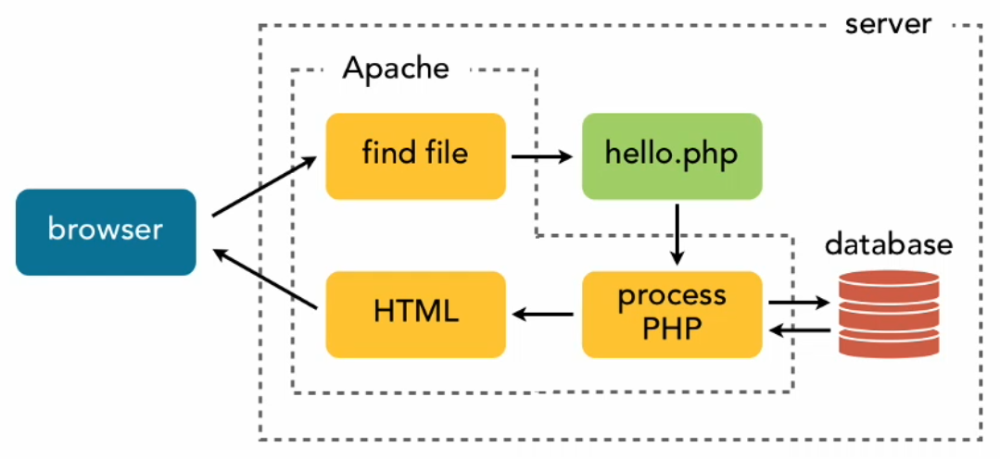

# PHP
PHP е един от най-използваните и широко разпространени скриптови езици за генериране на динамични web страници.
PHP означава Hypertext Preprocessor. PHP първоначално е създаден от Rasmus Lerdorf през 1994 г. Първоначално е известен като Personal Home Page.

PHP скриптовете се изпълняват на сървъра и резултатът се изпраща до уеб браузъра като обикновен HTML. PHP може да бъде интегриран с редица популярни бази данни, включително MySQL, PostgreSQL, Oracle, Microsoft SQL Server, Sybase и т.н. Текущата основна версия на PHP е 8.

Типична комуникация заявка-отговор

## Как да работим с този туториал ?
За целта трябва да клонирате/свалим текущото хранилище във вашата публична директория на локалния ви PHP сървър (xampp or wamp). Тук е важно да се спази взаимното разположение на директориите, така че главната папка php-tutorials да се разположи в публичната директория на сървъра. След това просто пускате сървъра и следвате инструкциите.
> Най-лесният вариант за сваляне е през зеления бутон Code -> Download Zip и после си разархивирате php-tutorials.

## PHP и MySQL
- [Връзка с MySQL](connection/README.md)
- [Създаване на база. CREATE DATABASE.](create_db/README.md)
- [Създаване на таблица. CREATE TABLE.](create_tbl/README.md)
- [Вмъкване на записи. Insert.](insert/README.md)
- [Изготвени заявки. Prepared statements](prepared/README.md)
- [ID на последно добавения запис. Last inserted ID. UNDER CONSTRUCTION](last/README.md)
- [Select заявки. MySQL SELECT Query.](select/README.md)

Източник:
- [PHP tutorial](https://www.tutorialrepublic.com/php-tutorial/php-mysql-introduction.php)
